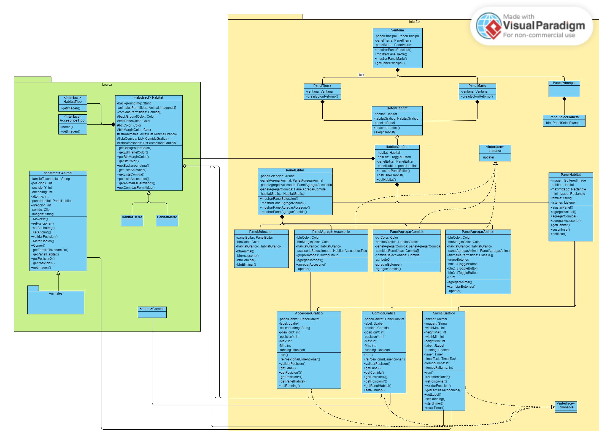
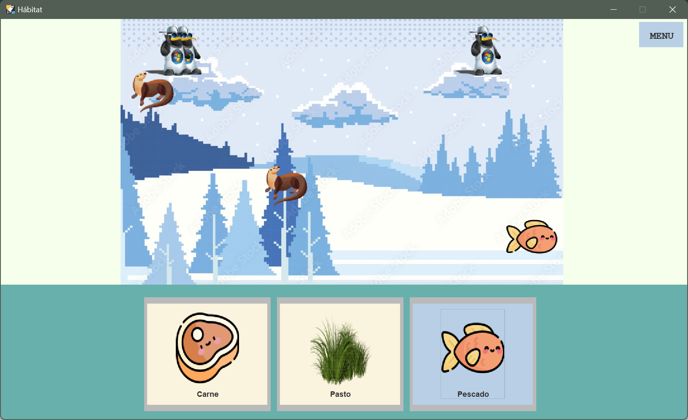

# D.O.O---ProyectoFinal

**Numero de Grupo:** #17

**Integrantes:**

* Antonio Benavides
* Maria Jose San Martin
* Valeria Quiroga

Este proyecto consiste en simular el funcionamiento de un zoológico,
que permite a los usuarios crear y gestionar su propio zoológico virtual de manera interactiva.

Algunas de las caracteristicas del proyecto son:
* Menu para seleccionar el planeta en el que se quiere crear y gestionar un Zoo.
* Multitud de Habitats, animales, comidas y accesorios unicos para cada planeta.
* Simulacion del movimiento de los animales dentro de sus habitats.
* Posibilidad de alimentar a los animales.
* Posibilidad de decorar los habitats con accesorio.
* Los animales emiten sonidos de felicidad cuando se les alimenta.

El proyecto esta dividido en 2 parte:

1. **Logica:** Contiene la logica de los zoologicos, sus habitats y animales
    * Animales: Clases que representan a los Animales y sus comportamientos individuales.
    * TipoHabitats: Todos los tipos de habitats que existen en el proyecto, su disponibilidad depende del planeta que se visite.

2. **Interfaz:** Contiene la lógica de la interfaz gráfica de usuario, incluyendo paneles,
   botones y sonidos.
    * Habitats: Conjunto de clases que permite la visualizacion he interaccion con los habitats.
    * Objetos Graficos: Conjunto de clases que grafica visualemnte los elementos de la parte logica.
    * Imagenes: Gestiona las imagenes que se usan dentro de los paneles.
    * Sonidos: Gestiona los efectos de sonido para mejorar la experiencia del usuario.
    * Ventana: La clase principal que inicializa la interfaz gráfica y gestiona su funcionamiento.
    * Paneles Extras: Permiten la navegacion entre planetas.

**Diagrama UML**:
-

**Diagrama de Casos de Uso**:
-

**Patrones utilizados**:
-
   
|      Patron      | Justificación                                                                                                                                                                                                          |
|:----------------:|:-----------------------------------------------------------------------------------------------------------------------------------------------------------------------------------------------------------------------|
|      Bridge      | Animal es la Abstraccion y AnimalGrafico es la Implementación, uno se encarga de la logica y el otro de como se muestra al animal, de esta forma se divide una clase demaciado grande en 2 estrechamente relacionadas. |
|     Observer     | AL colocar Objetos dentro de los habitats, los habitats informan a al Clase que se suscriba donde clickea el usuario para colocar el Objeto.                                                                           |
| Template Method  | Se ocupa la clase Animal como plantilla para el resto de animales.                                                                                                                                                     |

**Interfaz Grafica**:

-

**Decisiones tomadas durante el desarrollo**:
-

* Forma en que se interactuaria con el usuario (Diagrama de Uso).
* De que forma le mostrariamos la interfaz al usuario, con JFrames por cada interactuable o con JPanel, finalmente escogimos que la seleccion de planetas y habitats fuera en un JFrame, la vista y configuracion de ese Habitat seria en otro JFrame, lo demas va en su propio JPanel dentro de los JFrame.
* Estetica única de nuestro proyecto, en nuestro caso elegimos estética marciana basandonos en un capítulo de `Rick and Morty`.
* El orden de desarrollo del proyecto, que funcionalidades desarrollar primero o que vistas.

**Problemas encontrados**:
-

* Como colocar los animales en pantalla, lo pudimos solucionar utilizando un patron, pero esto fue practicamente al final del Desarrollo.
* Como crear la clase enum de HabitatTipo y Accesorios de modo que se pudiera extender dentro del HabitatTierra y HabitatMarte.
* Hacer los test, ya que la mayoria de aspectos del proyecto involucraban la validacion visual.
* Intercambiar paneles sin que surjan problemas de visibilidad y lag.
* Encontrar imagenes del mismo estilo para el projecto, algunas estan hechas por nosotros mismos.

**Estructura del Proyecto**:
-

